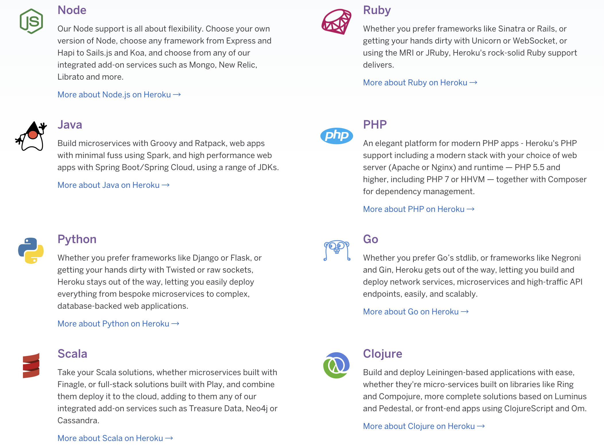
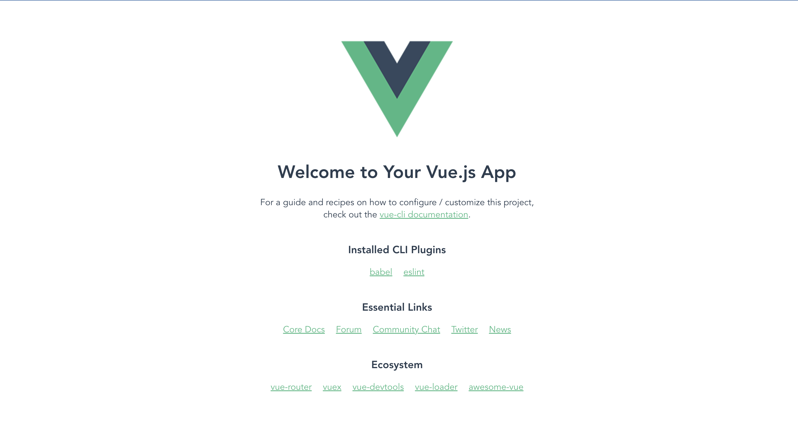
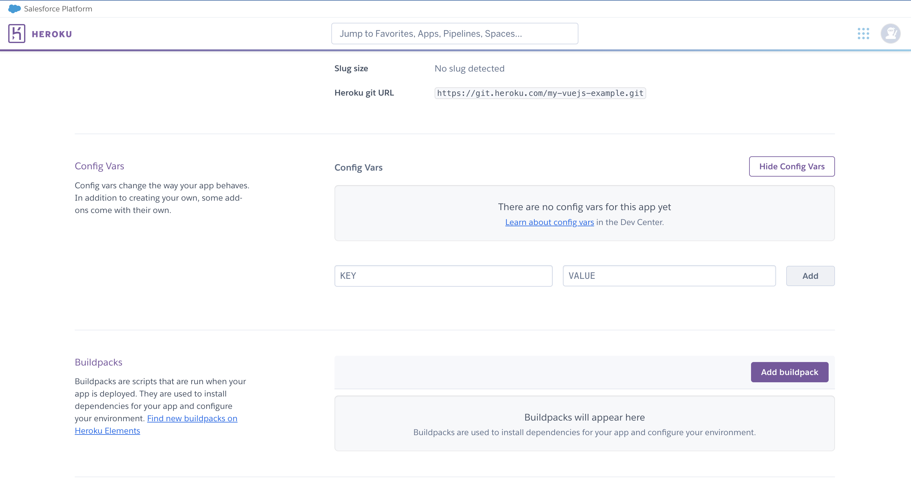

<script setup>
  import ArticleTitle from '@theme/components/ArticleTitle.vue'
</script>

<ArticleTitle />

## 前言
自從成為web工程師的時候，除了工作需要的專案開發之外，在閒暇之餘也累積了一些side project。

當初會做side project的契機，除了是想要嘗試沒碰過的技術以外，另外一個目的是建立自己的作品集。

不過若要將作品公開出來，勢必會需要學習如何將作品部署上線。

剛開始找到不需要具備太多網頁部署知識就能部署的服務供應商[Heroku](https://www.heroku.com/)，但後來也隨著作品的增加、技術的成長也慢慢開始接觸了CICD、業界常用的雲端服務([AWS](https://aws.amazon.com/tw/), [GCP](https://console.cloud.google.com/?hl=zh-TW))。

慢慢朝著<s>不專業SRE</s>的方向發展(誤)。

在這一段期間也透過這些服務部署了幾個自己的專案作品，因為自己是個<s>窮光蛋</s>，因此使用這些服務都是秉持著免費仔的原則去使用。

這一次就決定將使用這些服務的心得及收穫紀錄下來，本篇將會介紹部署到Heroku的流程，提供給大家分享。

## 為何選擇Heroku
第一次有需要將自己作品部署到線上，是在還沒有正式進入web開發的領域，準備轉職的時候。

如果單純是將純HTML + JS + CSS作品放到網路上的話，只需要用[Github Page](https://pages.github.com/)就能滿足這個需求。

不過後來也開始接觸了Vue CLI、Laravel等前端、後端框架，除了需要將專案打包以外，也需要DB跟server才能把專案弄上線，自然而然就需要尋找合適的server供應商。

因為當時在補習班學習的時候主要是前端為主，也因此對於server的環境設定的部署也就沒有太多的概念。

要將作品弄到線上，我只有一個原則：<b>花最少的錢，最簡單的方式完成。</b>

因此最後選擇了[Heroku](https://www.heroku.com/)。

## Heroku介紹
Heroku是一個提供雲平台即服務Paas（platform as a service)的廠商。

什麼是雲平台即服務呢？ 簡單來說: 它提供了架設網站環境的基本介面，在不需要太多server的環境設定及Linux操作就能夠將專案簡單的部署上線。

目前Heroku[支援了市面上大多數主流的開發語言環境](https://www.heroku.com/languages)，如: NodeJs, PHP, Python等等...

如果想部署常用的框架，例如PHP的Laravel也都是沒問題的哦 ！



Heroku基本上是可以免費使用的，不過免費版本會有下面的一些限制：

- 如果30分鐘內，沒有請求的話，機器會自動進入休眠，直到新的請求進來才會喚醒，但是喚醒的時候需要一點時間，新的請求API會卡住很久 (因此不太適合做cronjob等排程作業)。
- 免費的機器使用上限為550小時 (如果有綁定信用卡的話會再有額外450小時) 。
- 機器規格的限制 (1x CPU and 512MB RAM)，Heroku提供的機器規格配置，可以參考[Dyno Types](https://devcenter.heroku.com/articles/dyno-types) 。

如果還想知道更多Heroku的免費及付費資訊，可以參考官網的[pricing](https://www.heroku.com/pricing)以及[free limit文件](https://devcenter.heroku.com/articles/limits)。

### 部署流程

1. 首先，當然是需要先到[官網註冊帳號](https://signup.heroku.com/)。

2. 接著會需要在自己的電腦安裝[Heroku CLI](https://devcenter.heroku.com/articles/getting-started-with-nodejs#set-up)。如果是Mac的使用者，可以選擇使用[Homebrew](https://brew.sh/index_zh-tw)安裝：
```
brew install heroku/brew/heroku
```

3. 安裝CLI完成後，可以試著輸入用終端機指令檢查是否有成功安裝
```
heroku
```

接著，就可以登入自己的Heroku帳號
```
heroku login
```

如果出現下面的畫面，就表示成功登入了～


4. 接下來就需要準備一個專案了，我們先建立簡單的vue-cli專案當作範例，並且將專案打包及建立git + commit：
```
# create
vue create your-project-name
# build
yarn build
# git
git init
git add .
git commit -m 'Feat: First commit'
```

5. 接著參考[Vue官方文件](https://cli.vuejs.org/guide/deployment.html#stdlib)，建立`static.json`檔案，內容如下：
```
{
  "root": "dist",
  "clean_urls": true,
  "routes": {
    "/**": "index.html"
  }
}
```

並且同樣將`static.json`commit出去。

6. 完成了上面的配置後，就可以準備將專案弄上線了，首先需要在Heroku這邊建立一個新的project，指令如下：
```
heroku create your-project-name
```
建立完成後就會得到專案的domain以及git remote url，這邊先記錄下來待會會使用到。


接著需要新增config配置：
```
heroku buildpacks:add heroku/nodejs --app your-project-name
heroku buildpacks:add https://github.com/heroku/heroku-buildpack-static --app your-project-name
```
上面的第一個指令主要是設定這個專案使用的環境配置(因為是前端，因此選擇nodejs)，這邊基本上就是對應你是用什麼語言做開發。

第二個指令是for靜態頁面及SPA網頁的配置，可以參考[官方文件](https://elements.heroku.com/buildpacks/heroku/heroku-buildpack-static)的說明。

7. 接著就將剛剛建立project時拿到的git remote新增到你的專案，然後git push到Heroku上面。
```
# remote heroku
git remote add heroku  https://git.heroku.com/bibiota-vuejs.git
# git push
git push heroku master
```

8. push出去後就會自動進行部署，成功的話就可以到剛剛拿到的domain或是輸入下面的指令前往查看了～
```
heroku open
```

是不是很簡單呢！ 實際上真的是不需要太多部署知識就能夠把你的作品放到線上了！


### 補充

如果你的專案有.env的環境變數需要設定的話，可以到[Heroku dashboard](https://dashboard.heroku.com/apps)->project->Settings->Config Vars新增。


另外，如果是後端專案的話，Heroku也有提供clearDB Add-ons可以建立MySQL資料庫。

需要注意的是Add-ons會需要信用卡認證，但如果在免費額度內使用的話是不會有費用產生。

建立clearDB可以輸入以下指令，或是在直接在dashboard介面新增。

```
heroku addons:create cleardb:ignite --app my-vuejs-example
```

個人使用過Heroku cleardb的心得是覺得在介面操作方面不是很好用，所以後來有後端專案部署需求的話我都選擇其他的服務供應商XD

### 總結
以上是個人透過Heroku部署的一些心得，總結一下Heroku的優缺點如下：

優點：
- 可以用heroku自己的domain，不用自己買網域、DNS服務。
- 不需要具備太多部署知識和流程，就能輕鬆把專案部署到線上
- 可以用git版控。

缺點：
- 如果30分鐘內，沒有請求的話，機器會自動進入休眠。
- 免費的機器使用上限為550小時。
- 免費機器的規格有限制。

謝謝大家的收看。

### 後記

就在寫完這篇文章的同時，又發現了另外一個我覺得更方便的平台[vercel](https://vercel.com/)。

下一篇將會分享使用vercel部署的過程。

後續也會分享試用AWS EC2、Google Compute Engine(GCE)來開一台VM部署專案的紀錄。

敬請期待:)
### 參考資料

[認識 Heroku，學習將 vue 專案部署至Heroku](https://medium.com/unalai/%E8%AA%8D%E8%AD%98-heroku-%E5%AD%B8%E7%BF%92%E5%B0%87-vue-%E5%B0%88%E6%A1%88%E9%83%A8%E7%BD%B2%E8%87%B3heroku-4f5d8bd9b8e2)

[[Deploy] 在 heroku & clearDB 環境部署 PHP & MySQL](https://medium.com/take-a-day-off/deploy-%E5%9C%A8-heroku-cleardb-%E7%92%B0%E5%A2%83%E9%83%A8%E7%BD%B2-php-mysql-2529a5f5844e)

[laravel 8部署到免費的Heroku](https://ithelp.ithome.com.tw/articles/10255241)